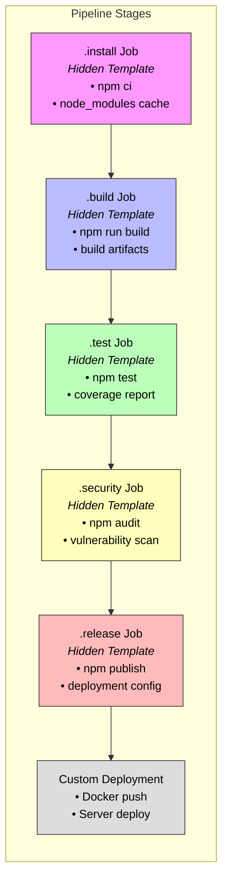

# ADO-Pipelines-Templates
This repo is meant to store all my Azure DevOps pipeline templates for future.

## Nodejs.yaml
A comprehensive template that incorporates all necessary components for a production-ready pipeline:

Let's visualize the pipeline structure and dependencies:

In the diagram above:

- Jobs prefixed with dots (.) are hidden templates that won't run directly
- Colors indicate different stages: pink for installation, blue for build, green for test, yellow for security, red for release, and gray for deployment
- Arrows show dependencies between jobs - each job must complete successfully before the next begins

### Key Components Explained

1. **Base Configuration**  - Uses latest Node.js image for maximum compatibility
  - Defines six stages covering all lifecycle phases
  - Sets up essential environment variables

2. **Installation Stage**  - Uses `npm ci` for deterministic builds
  - Implements caching for faster subsequent runs
  - Preserves package-lock.json for reproducibility

3. **Build Stage**  - Extends from npm-base template
  - Depends on installation stage
  - Stores build artifacts for 1 week

4. **Test Stage**  - Configures test coverage reporting
  - Generates JUnit XML reports
  - Includes Cobertura coverage format

5. **Security Scan**  - Performs npm audit checks
  - Attempts automatic fixes
  - Preserves security scan reports

6. **Release Stage**  - Handles npm package publishing
  - Requires manual approval on main branch
  - Depends on successful completion of previous stages

7. **Deployment Stage**  - Configurable deployment process
  - Sets up production environment
  - Requires manual approval

### Usage Instructions

1. Create a new file named `.gitlab-ci.yml` in your project root
2. Copy the entire configuration above
3. Customize environment variables and deployment scripts as needed
4. Configure GitLab CI/CD variables for sensitive information

### Important Notes

- All jobs extend from `.npm-base` template for consistency
- Security scan is marked as allow_failure to prevent pipeline failure on minor vulnerabilities
- Manual approvals are required for release and deploy stages on main branch
- Cache and artifact configurations optimize pipeline performance
- Coverage reporting helps track test effectiveness

This template provides a production-ready pipeline that covers installation, building, testing, security scanning, releasing, and deployment while maintaining flexibility for customization.
